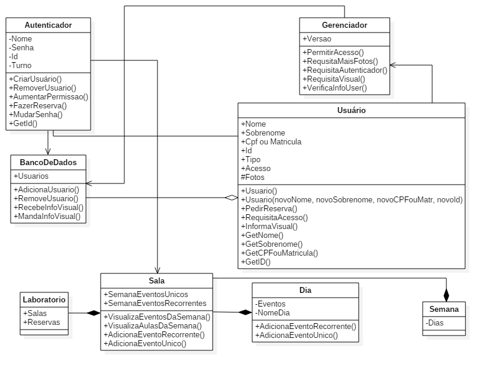
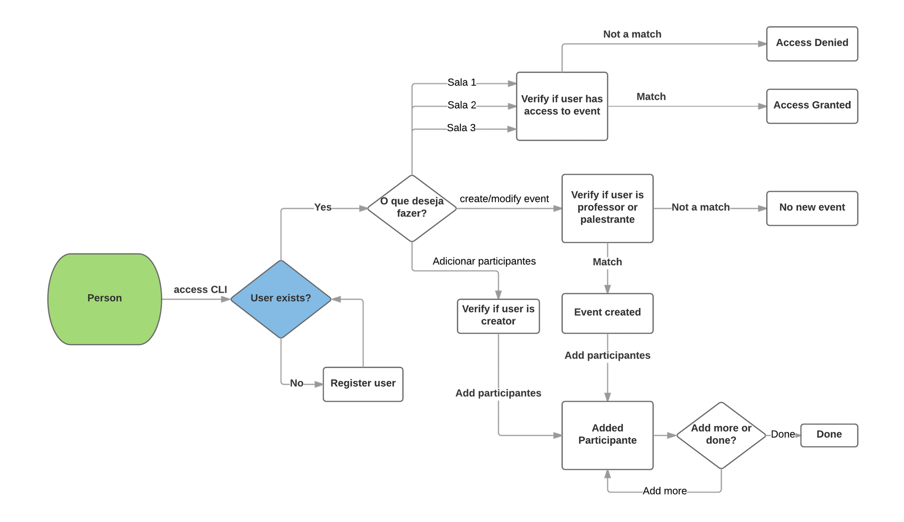

# Projeto 2

## Resumo

### Geral

Este projeto consiste em implementar um sistema de identificação de rostos para acesso a um suposto laboratório.
A linguagem de programação a ser usada é o C++ e funcionalidades das bibliotecas do OpenCV serão incorporadas ao projeto. Devido ao curto espaço de tempo, não haverá desenvolvimento de GUI, tudo ocorrerá em linha de comandos (CLI).

### TDD

Para melhor resultado, é aconselhável o uso da técnica conhecida como TDD, test driven development, que consiste em:
1. Criar teste;
2. Teste falhar;
3. Implementar código (mantém-se no 3 enquanto 4 não ocorrer);
4. Teste bem sucedido;
5. Voltar ao passo (1) até conclusão do projeto.

## Detalhamento do Projeto

### O Laboratório

O Laboratório é composto de 3 salas e funciona das 8h às 22h, depois disso, acaba-se o turno do responsável pelas modificações de usuários e reservas, o que torna o laboratório espaço restrito apenas a aqueles que já haviam reserva foram do horário padrão.

### O Autenticador

Também conhecido como porteiro/segurança/administrador, é ele que faz todo e qualquer tipo de alteração às reservas e usuários. Considera-se o autenticador um ser onipresente, ele encontra-se em todas as salas e fora do laboratório ao mesmo tempo.

### O Gerenciador

É a maquininha que olha pra sua cara e te diz se você é feio ou bonito. Se ele não gostar da sua cara, você não entra, simples assim. Falando sério agora: é isso mesmo que eu falei.

### A Sala

É uma sala normal, contém coisas que uma sala normal possui, você precisa ter uma aula ou evento registrados nela para ter acesso. Ela tem um limite de capacidade de 20 pessoas, não há como comportar mais pessoas adequadamente.

### O Usuário

É você, você mesmo, você, esse ser capaz de quebrar o sistema mais estável do universo. Você é classificado entre usuário genérico, professor, aluno, palestrante e funcionário (limpeza, manutenção e estagiário de TI). Usuários genéricos tem acesso apenas ao laboratório, sendo vetada a entrada às salas, o professor tem acesso às salas designadas a ele e tem a capacidade de agendar salas, seja de forma recorrente ou não. O mesmo vale para o palestrante, porém ele não pode agendar salas para eventos recorrentes, somente únicos. O aluno só entra na sala designada a ele e se ficar triste, nem na sala entra. Já o funcionário pode entrar na sala que quiser e reservar a sala que quiser (contanto que não esteja reservada por ninguém, é claro).

### Quem pode reservar sala?

Professores, funcionários e palestrantes podem reservar salas. Está na descrição acima! Deve ter mão de estagiário aqui, só pode. Lembrando, professores e funcionários agendam eventos recorrentes e únicos, palestrantes somente eventos únicos. Não há limite de salas agendadas, espera-se que indivíduos sejam sensatos e agendem somente as salas necessárias.

## Diagramas

### Classes



### Decisão de usuário



### Sequências

#### Realizar cadastros


#### Entrar em uma sala


#### Requisitar reserva de sala


## Como instalar

Uma vez que se tenha o g++ em sua máquina, baixe o repositório usando o terminal ou o equivalente:
```
git clone git@gitlab.com:victorLandim/TP1Projeto2.git
```

Depois deve-se navegar até o diretório
```
cd local/onde/está/o/código/TP1Projeto2
```

Depois compilar o main.cpp
```
g++ main.cpp
```

E executar
```
./a.out
```

Para fazer testes unitários, deve-se compilar usando
```
g++ test.cpp
```

Para usar o CMake em vez de compilar tudo, deve-se ir ao diretório e digitar
```
cmake .
make
```

Depois executar
```
./LabSis
```

Para ter acesso ao Git Time Metric
'''
git fetchgtm
'''

Para saber o tempo gasto nos últimos dias do projeto (irá mostrar todos os últimos 50 commits)
```
gtm report -n 50
```

Ou, para obter uma timeline
```
gtm report -this-year -format timeline-hours
```
## Bibliotecas externas

### Git Time Metric

- GTM é usado para registrar o tempo gasto em cada arquivo e no total, útil para ter noção de onde a equipe está focando mais. Ele é leve, automático e há plugin para a maioria dos editores de texto. There is no need to remember to start and stop timers. It runs on occasion to capture activity triggered by your editor. The time metrics are stored locally with the git repository as Git notes and can be pushed to the remote repository.

Repositório: https://github.com/git-time-metric/gtm

### Catch Unit Testing (LEIAM)

- What's the Catch?

Catch significa C++ Automated Test Cases in Headers e é uma framework de testes automatizada. Funciona pra C, C++ e Objective-C. Ela é implementada inteiramente em header file. Muito easy de usar.

- Básico
https://github.com/philsquared/Catch/blob/master/docs/tutorial.md

- Para acelerar a compilação dos unit tests (bem provável que não cheguemos a precisar)
https://github.com/philsquared/Catch/blob/master/docs/slow-compiles.md

Repositório: https://github.com/philsquared/Catch

### JSON for Modern C++

Design Goals:
- Serious Testing (they use Catch too);
- Intuitive Syntax;
- Trivial integration (just add json.hpp and you're ready to go).

Repositório: https://github.com/nlohmann/json

### TODO:

* [x] Criar diagrama de classe (Alexandre);
* [ ] Verificar diagrama de classes (Caio);
* [x] Criar diagrama de sequências (Alexandre);
* [ ] Verificar diagrama de sequências (Caio);
* [ ] DOING - Implementar unit tests (Alexandre, Caio e Victor);
    * [x] Classe Gerenciador
    * [x] Classe Usuário
    * [x] Classe Autenticador
    * [x] Classe Dia
    * [x] Classe Semana
    * [x] Classe Sala
    * [ ] Classe Laboratório
    * [ ] Classe Banco de Dados
* [ ] Classe Banco de Dados
* [ ] DOING - Implementar o projeto (Alexandre, Caio e Victor);
    * [ ] CLI
    * [x] Classe Gerenciador
    * [x] Classe Usuário
        * [ ] Fazer leitura e gravação em JSON
    * [x] Classe Autenticador
        * [ ] Fazer leitura e gravação em JSON
    * [x] Classe Dia
        * [ ] Fazer leitura e gravação em JSON
        * [ ] Implementar classe evento
        * [ ] Implementar cancelamento de eventos
    * [x] Classe Semana
        * [ ] Fazer leitura e gravação em JSON
    * [x] Classe Sala
        * [ ] Fazer leitura e gravação em JSON
    * [ ] Classe Laboratório
        * [ ] Fazer leitura e gravação em JSON
    * [ ] Classe Banco de Dados
        * [ ] Fazer leitura e gravação em JSON
    * [x] Adicionar biblioteca de JSON
    * [x] Uso de CMake
    * [x] Uso de doxygen
    * [ ] Finalizar
* [ ] Comentar todas as classes para o doxygen
* [ ] Implementar reconhecimento facial (Alexandre, Caio e Victor);
* [ ] Fazer png's dos svg's

### Os arquivos

1. classes.cpp
    - Onde está a implementação das classes;
2. main.cpp
    - Onde está a implementação da CLI não terminada;
3. CMakeLists.text
    - Arquivo para o cmake
4. notused/
    - Arquivos usados para nortear o projeto ou não mais usados;
5. doxygen/
    - Todos os arquivos gerados pelo doxygen
6. img/
    - Pasta contendo todas as imagens do projeto
7. others/
    - Pasta com as bibliotecas externas (excetuando gtm)

#### Diagramas de sequência feitos com:

Inicialmente:
* https://bramp.github.io/js-sequence-diagrams/
Finalmente:
* https://www.lucidchart.com/
