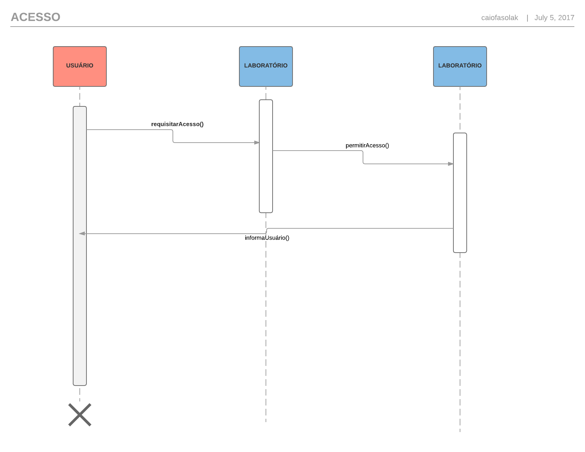

# Projeto 2

## Resumo

Este projeto consiste em implementar um sistema de identificação de rostos para acesso a um suposto laboratório.
A linguagem de programação a ser usada é o C++ e funcionalidades das bibliotecas do OpenCV serão incorporadas ao projeto. Devido ao curto espaço de tempo, não haverá desenvolvimento de GUI, tudo ocorrerá em linha de comandos (CLI).

Para melhor resultado, é aconselhável o uso da técnica conhecida como TDD, test driven development, que consiste em:
1. Criar teste;
2. Teste falhar;
3. Implementar código (mantém-se no 3 enquanto 4 não ocorrer);
4. Teste bem sucedido;
5. Voltar ao passo (1) até conclusão do projeto.

## Detalhamento do Projeto

### O Laboratório

O Laboratório é composto de 3 salas e funciona das 8h às 22h, depois disso, acaba-se o turno do responsável pelas modificações de usuários e reservas, o que torna o laboratório espaço restrito apenas a aqueles que já haviam reserva foram do horário padrão.

### O Autenticador

Também conhecido como porteiro/segurança/administrador, é ele que faz todo e qualquer tipo de alteração às reservas e usuários. Considera-se o autenticador um ser onipresente, ele encontra-se em todas as salas e fora do laboratório ao mesmo tempo.

### O Gerenciador

É a maquininha que olha pra sua cara e te diz se você é feio ou bonito. Se ele não gostar da sua cara, você não entra, simples assim. Falando sério agora: é isso mesmo que eu falei.

### A Sala

É uma sala normal, contém coisas que uma sala normal possui, você precisa ter uma aula ou evento registrados nela para ter acesso.

### O Usuário

É você, você mesmo, você, esse ser capaz de quebrar o sistema mais estável do universo. Você é classificado entre usuário genérico, professor, aluno, funcionário (limpeza, manuteção e estagiário de TI), palestrante.

### Quem pode reservar sala?

Professores, funcionários e palestrantes podem reservar salas.

### Behaviors

#### Realizar cadastros



#### Entrar em uma sala


#### Requisitar reserva de sala


## Como instalar

Uma vez que se tenha o g++ em sua máquina, baixe o repositório usando o terminal ou o equivalente:
```
git clone git@gitlab.com:victorLandim/TP1Projeto2.git
```

Depois deve-se navegar até o diretório
```
cd local/onde/está/o/código/TP1Projeto2
```

Depois compilar o main.cpp
```
g++ main.cpp
```

E executar
```
./a.out
```

Para fazer testes unitários, deve-se compilar usando
```
g++ test.cpp
```


## Usando Catch Unit Testing (LEIAM)

- What's the Catch?

Catch significa C++ Automated Test Cases in Headers e é uma framework de testes automatizada. Funciona pra C, C++ e Objective-C. Ela é implementada inteiramente em header file. Muito easy de usar.

- Básico
https://github.com/philsquared/Catch/blob/master/docs/tutorial.md

- Para acelerar a compilação dos unit tests
https://github.com/philsquared/Catch/blob/master/docs/slow-compiles.md

### TODO:
- Criar diagrama de classes (hard)
- Criar diagrama de estados (impossible)
- Implementar o projeto (easy)


#### Diagramas de sequência feitos com isto:
* https://bramp.github.io/js-sequence-diagrams/
